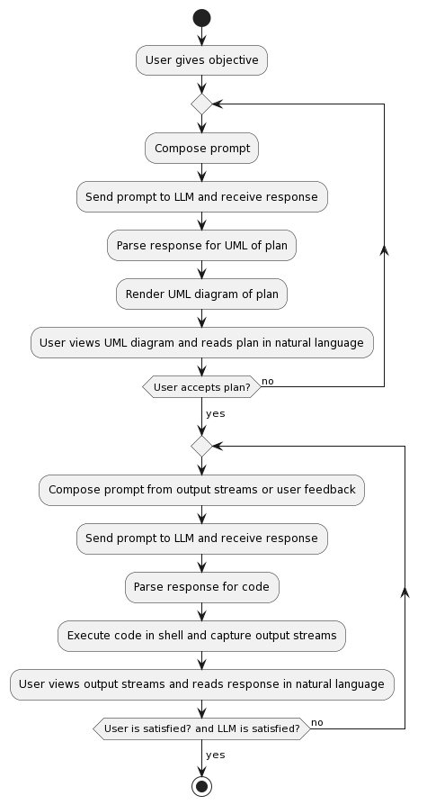

# Khod-Kaar: An LLM-based code-writing agent

[](https://github.com/danmohad/khod-kaar/actions/workflows/ci-main.yml)

## Description
Given a user's objective, `khod-kaar` will develop, test, document and execute code autonomously to achieve that objective.

`khod-kaar` will first guide the LLM to develop a plan for how to achieve the user's objective, and to output and render UML diagrams to show concretely the software development plan.

Once the user consents to the plan, `khod-kaar` will guide the LLM to develop code relevant to the user's goal in a step-wise manner, including version control and testing.

Since `khod-kaar` has direct access to the shell, it provides the LLM with direct feedback from program execution and testing.

When the user's objective is met, the program gracefully exits.

The program flow is shown in the UML diagram below:



## Requirements
- A basic workstation
- An internet connection
- OpenAI API credentials

## Setup
1. Clone the repo locally.
    - `git clone https://github.com/danmohad/khod-kaar`
2. Navigate to the cloned repo.
    - `cd /path/to/khod-kaar`
3. Ensure your OpenAI API credentials are available as environment variables. A `.env` file is most convenient for this.
    - `OPENAI_API_KEY`
    - `OPENAI_ORG_KEY`
4. Ensure you have all dependencies installed.
    - `java`, `graphviz` and [`plantuml`](http://sourceforge.net/projects/plantuml/files/plantuml.jar/download) to render the UML diagrams
    - `python3` with all the packages in `requirements.txt`.  A python virtual environment is most convenient for this.

### Containerized with Docker
Running the code in a containerized environment saves you the trouble of any dependency installation, and is safer for your file system. A Docker file is provided with the repo to set up a Debian environment with the necessary dependencies.

### Ready-for-dev with VSCode
The easiest way to get started running and contributing to `khod-kaar` is by loading it as a dev container in VSCode. There are already some debugging cases set up in `.vscode/launch.json` to get you started.

## How to run it
Suppose your objective is "to write, test and execute a simple Python program that writes 'Hello, World!'" Then to get `khod-kaar` to do this for you, it is as simple as:
```
python khod_kaar.py -o "to write, test and execute a simple Python program that writes 'Hello, World!'"
```

Additional parameters are available and can be viewed by executing `python khod_kaar.py --help`.

## MIT License
This repo is under an MIT License. Still, I urge you to be responsible with the abilities it gives you.

## Don't be evil
It's not difficult to think of ways to perform nefarious and antisocial actions with AI in general and LLMs in particular. Don't do them.

## Don't be reckless
Understand that `khod-kaar` interacts with the shell where it is run. Commands and code executed by `khod-kaar` may damage your machine or even other machines; it has just as much authority over the environment in which it is run as you do. Be sure you understand each shell command `khod-kaar` will execute before approving it. Exercise extreme caution in using the autopilot `-a` flag, as it is meant primarily for debugging and demonstration purposes and __will execute arbitrary code on your machine witout your consent and outside of your control__. 

## Contributing
Forks and pull requests are welcome! For some ideas on what to work on, see the [issues](https://github.com/danmohad/khod-kaar/issues). Please adhere to the [Google style guide for Python](https://google.github.io/styleguide/pyguide.html).

## What's with the name?
In many languages of south-central Asia and the Indian subcontinent, the word _khod_ means 'self' and _kaar_ means 'work' or 'action'. Thus, to many people, _khod kaar_ can render a meaning like 'autonomous action', which is what this repo does. _Khod_ also sounds like 'code', and _code kaar_ has a meaning approaching 'code worker', which is what this repo is. In Persian the term _khod kaar_ specifically means 'ball-point pen'. When compared to a quill or reed, a ball-point pen is certainly closer to autonomous action by easing the task of the writer, and that is also what this repo aims to do.
